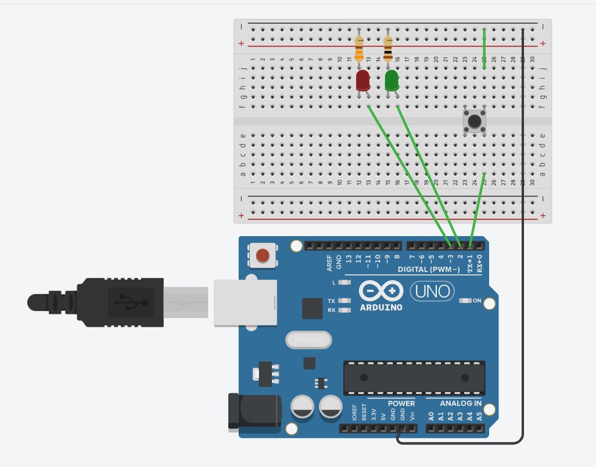
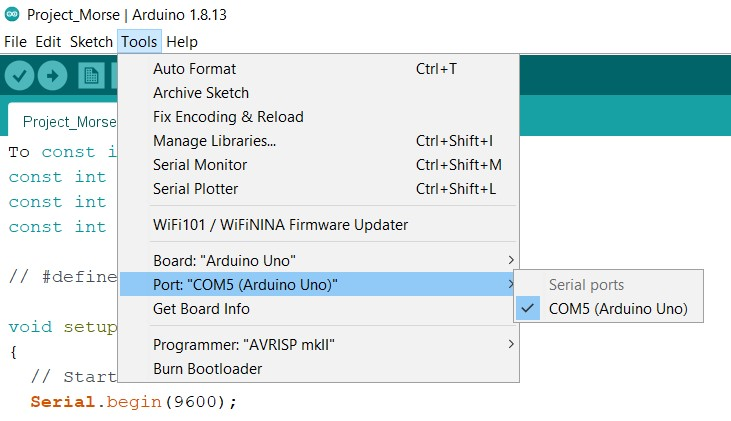

# Project Morse

>Ver versão portuguesa [aqui](#projeto-morse)

Project Morse is a Morse code decoder based on Arduino and python that allows to learn morse code in a more interactive way.

This project was initially developed for the 2020 JOTA-JOTI and has since been improved.

## Como funciona

To use this project, you must assemble the above circuit. This is a simple circuit with a button connected to the arduino and two LED connected to resistors.

The arduino can detect when someone is pressing the button and decode the morse code.

The characters decoded by the arduino are sent via USB to a computer and received by one of the programs in the "Games" folder that display it on the screen or use them to play the hangman.

To run these programs, you must have [python](https://www.python.org/downloads) installed on your computer, and then install the dependencies opening a command line on the Games folder and typing the following command:

`> pip install -r requirements.txt`

To run the programs, you must go to the repository root and execute one of the following commands:

To only show the letters:

`> python UI.py [COM port]`

To play hangman:

`> python hangman.py [COM port] [word]`

To find out which COM port your arduino is connected to, you can open the arduino IDE and go to Tools -> Port (see image below).

## Material

- Arduino
- Red LED
- Green LED
- Button
- 100R resistor
- 330R resistor
- Breadboard
- USB cable for the Arduino
- Computer with Python and Arduino IDE installed

# Projeto Morse

>See English version [here](#project-morse)

O projeto Morse é descodificador de código Morse baseado em Arduino e python que permite aprender a transmitir código morse de forma mais dinâmica.

Este projeto foi desenvolvido inicialmente para o JOTA-JOTI de 2020 e tem sido melhorado desde então.

## Como funciona

Para utilizar este projeto, é necessário montar o circuito da figura acima. Este circuito simples é apenas composto por um botão ligado ao arduino e dois LEDs ligados em série com resistências.

O arduino consegue detetar quando alguém está a carregar no botão e descodificar o código morse.

As letras descodificadas pelo arduino podem ser depois enviadas por USB para o computador e ser lidas por um dos programas na pasta "Games" e ser mostradas no ecrã ou utilizadas para jogar à forca.

Para executar estes programas é necessário instalar o [python](https://www.python.org/downloads), instalar as dependências abrindo uma linha de comandos, navegar para a pasta Games e executando o comando:

`> pip install -r requirements.txt`

Para executar os programas deve-se navegar para o root do repositório e executar um destes comandos:

Para ver apenas as letras:

`> python UI.py [COM port]`

Para jogar à forca:

`> python hangman.py [COM port] [word]`

Para descobrir a que COM port o arduino está conectado, abre o arduino IDE e vai a Tools -> Port (vê imagem em baixo).

## Material

- Arduino
- LED Vermelho
- LED Verde
- Botão
- Resistência de 100R
- Resistência de 330R
- Breadboard
- Cabo USB para o Arduino
- Computador com Python e o Arduino IDE instalado